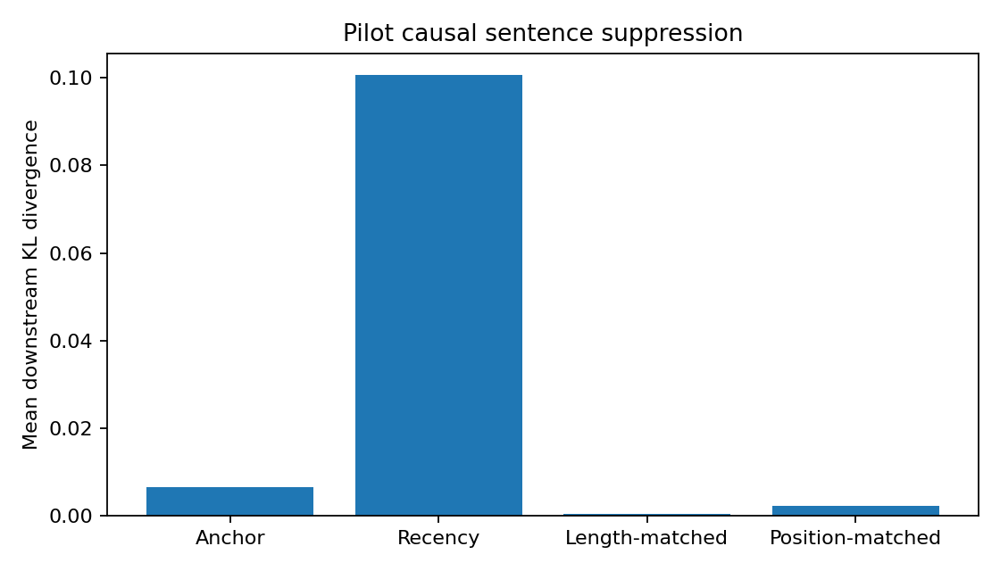

# AnchorKV

**Causal evaluation of thought-anchor-guided KV-cache compression for reasoning models.**

AnchorKV is a research prototype for testing whether a small set of
reasoning-critical attention heads can identify sentence-level steps that deserve
more KV-cache capacity. It preserves provisional and anchor steps in FP16 while
allowing less important steps to use INT8, INT4, or eviction under a fixed byte
budget.

> [!IMPORTANT]
> The repository now includes a physical PyTorch reference backend with FP16,
> symmetric INT8, and packed INT4 KV tensors. It measures real payload and scale
> storage, but it is not yet wired into a live generation loop or a fused vLLM
> attention kernel. Reported decode speedups therefore remain out of scope.

## Research question

Can receiver-head attention identify causally important reasoning steps better
than all-head or recency heuristics, and preserve answer quality under the same
KV-cache budget?

The project separates three claims that must be evaluated independently:

1. **Head discovery:** receiver heads are stable across reasoning traces.
2. **Anchor validity:** sentences selected by those heads causally affect later
   logits or final answers.
3. **Systems value:** protecting those sentences improves the
   quality-memory-latency frontier.

## Preliminary T4 result

An initial three-example Qwen3-0.6B pilot appeared positive, but every selected
anchor was the final solution sentence before the answer. A controlled rerun
required a 32-token downstream horizon and added a position-matched control.
It **did not support the anchor-validity hypothesis**: recency suppression had
mean downstream KL **0.1006**, versus **0.0066** for the attention-selected
sentence. The selected sentence was the first reasoning span in every trace,
including generic text such as “Okay, let's see.”



This is a useful negative result. It exposes boundary-token attention as a
confound rather than presenting the earlier effect as validation. Peak
causal-stage GPU allocation was **1.52 GiB** on a Tesla T4. See the
[controlled result](docs/experiments/2026-09-03-t4-causal-controlled.md) and the
[superseded initial pilot](docs/experiments/2026-09-03-t4-causal-pilot.md).

## Design

```text
Visible reasoning trace
        |
        v
Sentence token spans --------------------------+
        |                                       |
        v                                       |
Receiver-head attention                         |
        |                                       |
        v                                       |
Delayed anchor tracker                          |
  (new steps remain provisional)                |
        |                                       |
        +-----------> anchor score <------------+
                           |
                           v
                 Byte-budgeted planner
                  /       |       \
               FP16     INT8/4   evict
                 \        |        /
                  Physical KV block store
                           |
               declarative global/focus/local
                           |
                 dense execution materialization
```

The delayed tracker is necessary because a sentence can only be recognized as a
thought anchor after later reasoning steps attend to it. A provisional rolling
window prevents early eviction while that evidence accumulates.

For grouped-query attention (GQA), AnchorKV explicitly maps query-side receiver
heads onto their shared KV heads. This avoids pretending that every query head
owns an independently configurable KV cache.

## What is implemented

- Sentence and newline-based reasoning-step segmentation
- Mapping tokenizer offset spans to sentence-level token spans
- Token-to-sentence vertical attention aggregation
- Receiver-head ranking using kurtosis plus within-trace percentile stability
- Query-head to GQA KV-head mapping and score aggregation
- Delayed EMA-based thought-anchor decisions
- Estimated FP16, INT8, and INT4 KV storage including scale metadata
- Protected-anchor, fixed-byte-budget cache planning
- Physical FP16, symmetric INT8, and nibble-packed INT4 KV storage
- Per-block requantization with real payload and scale byte accounting
- Multi-layer Hugging Face legacy-cache conversion
- Incremental `<global>`, `<focus>`, `<local>`, `<anchor>`, and `<archive>` parser
- Declarative block visibility and dense execution-time materialization
- A deterministic end-to-end synthetic demonstration
- Bounded SDPA-generation/eager-replay extraction for Qwen3-0.6B
- Pickle-free, versioned attention-trace artifacts and head manifests
- KL-based causal-intervention scoring utilities
- Teacher-forced 4D attention-mask suppression with matched controls
- Unit tests for tensor shapes, GQA mapping, delay behavior, and budget safety

## Quick start

AnchorKV requires Python 3.10 or newer.

[](https://colab.research.google.com/github/Dev-Sinha13/Dynamic-Quantization/blob/main/notebooks/AnchorKV_T4_Trace_Collection.ipynb)

If GitHub access is unavailable or the repository is private, download and
upload [`notebooks/AnchorKV_T4_Standalone.ipynb`](notebooks/AnchorKV_T4_Standalone.ipynb)
directly to Colab. The standalone notebook embeds the experiment helpers and
does not clone this repository.

```bash
python -m venv .venv
source .venv/bin/activate       # Windows: .venv\Scripts\activate
python -m pip install -e .
anchorkv demo --budget-ratio 0.6
```

The demo injects a synthetic receiver head, discovers it from four traces, and
produces a JSON cache plan:

```json
{
  "receiver_heads": [
    {"layer": 1, "query_head": 2, "mean_kurtosis": 2.3324,
     "mean_percentile": 1.0, "stability": 1.0, "ranking_score": 1.0}
  ],
  "cache": {
    "budget_bytes": 2457,
    "used_bytes": 2320,
    "full_cache_bytes": 4096,
    "compression_ratio": 1.7655
  }
}
```

Install the research dependencies and run the physical backend demonstration:

```bash
python -m pip install -e ".[research]"
anchorkv requantize-demo --archive-mode int4
```

The deterministic demonstration stores a 192-token synthetic multi-region KV
cache. Archiving its two context regions as packed INT4 reduces actual tensor
storage from **12,288 bytes to 6,272 bytes** (1.96×), with maximum absolute
reconstruction error 0.278 for the seeded sample. These are tensor-storage
measurements, not CUDA-kernel latency results. See the
[requantization backend documentation](docs/requantization-backend.md).

Run the dependency-light test suite with:

```bash
PYTHONPATH=src python -m unittest discover -s tests -v
```

PowerShell:

```powershell
$env:PYTHONPATH = "src"
python -m unittest discover -s tests -v
```

## Repository layout

```text
src/anchorkv/
  segmentation.py  sentence and token spans
  heads.py         receiver-head analysis and GQA mapping
  policy.py        delayed anchors and cache-budget planning
  backend.py       physical quantization and declarative cache state
  cli.py           reproducible policy and requantization demos
tests/             dependency-light unit tests
docs/              experimental protocol and project roadmap
notebooks/         bounded Google Colab experiments
```

## Correctness boundaries

AnchorKV deliberately does not claim that attention is an explanation of model
reasoning. Receiver-head scores are hypotheses that must be checked through
attention suppression, counterfactual replacement, and downstream accuracy.

Similarly:

- Quantized cache values cannot be restored to the original FP16 values by
  dequantization.
- Exact reconstruction of a middle chunk generally requires recomputing its
  preceding causal context or starting from a valid checkpoint.
- Quantized storage does not imply faster attention unless a compatible kernel
  consumes the representation directly.
- Capturing full eager attention can cost more memory than the cache savings;
  production integration requires selected-head statistics from an efficient
  attention path.

## Evaluation plan

The Colab milestone integrates one open reasoning model. Subsequent causal and
physical-cache milestones will evaluate:

- Full cache
- Recent window plus attention sinks
- Random sentence retention
- All-head sentence importance
- Receiver-head anchors
- Causally validated receiver-head anchors

Primary metrics are exact-answer accuracy, peak GPU memory, KV bytes, decode
throughput, instrumentation overhead, and anchor-selection regret relative to a
causal oracle. See [the research plan](docs/research-plan.md) for hypotheses and
success criteria.

For the first GPU run, follow the [T4 Colab handoff](docs/colab.md). The notebook
pins the resolved Hugging Face model commit in every artifact and starts with a
768-token trace bound rather than attempting the model's full context window.

## Related work

AnchorKV is a reproduction-and-extension project, not a claim that thought-aware
cache compression is unexplored. It builds on:

- [Thought Anchors](https://arxiv.org/abs/2506.19143), which studies
  sentence-level attribution and receiver heads.
- [HeadKV](https://arxiv.org/abs/2410.19258), which allocates KV budgets by head.
- [R-KV](https://arxiv.org/abs/2505.24133), which targets redundancy in reasoning
  traces.
- [RLKV](https://arxiv.org/abs/2510.08525), which learns reasoning-critical head
  allocations with reinforcement learning.
- [Thought-Aware Attention Matching](https://arxiv.org/abs/2608.12331), which
  combines reasoning segmentation, adaptive budgets, and pivotal-token
  protection.
- [Declarative Attention](https://arxiv.org/abs/2609.02737), which lets models
  declare global, focused, and local context visibility and implements the
  resulting policy through block-aligned vLLM cache tables.

AnchorKV's intended extension is **training-free receiver-head discovery,
causal validation, delayed online decisions, declarative precision control,
and explicit GQA-aware physical cache storage**.

## License

MIT
