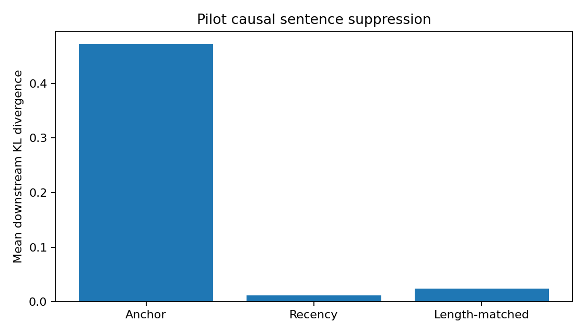

# T4 causal-suppression pilot: 2026-09-03

## Outcome

The first corrected causal pilot supports the AnchorKV sentence-causality
hypothesis on three arithmetic traces. Suppressing the receiver-head-selected
sentence produced substantially larger downstream distribution changes than
recency and token-length-matched controls.

This is a promising pilot, not a final validation. The sample size is three,
the replay is teacher-forced, suppression broadcasts across every attention
head, and all selected anchors were the final solution sentence immediately
before the answer.

## Provenance

- Archive: `anchorkv-colab-traces (3).zip`
- Archive SHA-256:
  `AE0556907B8250B5F27DD3655B5EC68CA4BD2E3AC44C5608F0D9624F6FE9EF53`
- GPU: Tesla T4, 14.56 GiB
- Peak causal-stage allocation: 1.430 GiB
- Model: `Qwen/Qwen3-0.6B`
- Model revision: `c1899de289a04d12100db370d81485cdf75e47ca`
- Receiver-head candidate: layer 23, query head 6
- Mask sanity maximum absolute logit difference: `0.0`

The raw machine-readable outputs are preserved in
[`data/causal-results.json`](data/causal-results.json),
[`data/receiver-heads.json`](data/receiver-heads.json), and
[`data/run-summary.json`](data/run-summary.json).

## Aggregate results

| Suppressed sentence | Mean downstream KL | Mean NLL change |
|---|---:|---:|
| Head-selected anchor | **0.4723** | **+0.4698** |
| Token-length-matched control | 0.0240 | +0.0296 |
| Recency control | 0.0117 | +0.0258 |

The anchor effect was about 19.7 times the length-matched KL and 40.5 times the
recency KL. Positive NLL change means the intervention made the observed
downstream tokens less likely.

## Per-sample interpretation

| Sample | Anchor KL | Recency KL | Matched KL | Anchor NLL change |
|---|---:|---:|---:|---:|
| `math-000` | 0.7642 | 0.0234 | 0.0717 | +0.7771 |
| `math-001` | 0.6481 | 0.0075 | 0.0002 | +0.6328 |
| `math-002` | 0.0044 | 0.0040 | 0.0001 | -0.0006 |

Two samples show large effects. The third is nearly tied with recency and has a
slightly negative NLL change, so the aggregate should not be presented without
the per-sample variation.

## Main confound and next experiment

The selected anchor was the last solution-bearing sentence before `Answer:` in
all three traces. Suppressing that sentence is expected to affect the answer,
and the current recency control is necessarily one sentence earlier. The pilot
therefore does not yet separate receiver-head selection from answer proximity.

The next experiment should:

1. Require every candidate anchor to leave at least 32 downstream tokens.
2. Evaluate a larger prompt set with automatic answer scoring.
3. Report confidence intervals and paired per-example differences.
4. Add a position-matched control as well as recency and length matching.
5. Attempt head-specific suppression only if the broader sentence effect
   remains after these controls.
